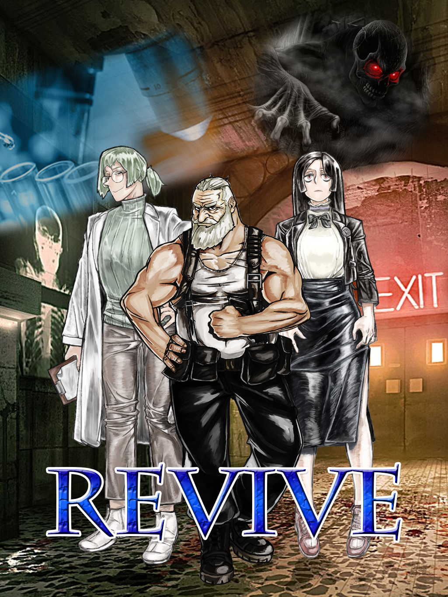

{: width="400" height="600"}

# About revive
Revive is pixijs, vue, mongodb based web story game. 😘

# Installation
To set this project up and running simply clone this repo and then:
* run ````npm install```` in the directory you downloaded it to install all dependencies.
* run ````npm run start```` to launch the webpack dev server with hot reloading.

# Developer
* Main Designer : Jisoo Kim
* UI/System Designer : Byeori Shin
* Server Developer : Daehoon Kim
* Client Developer : Hong Suk Yoo

# License
This is licensed under MIT, have fun!
